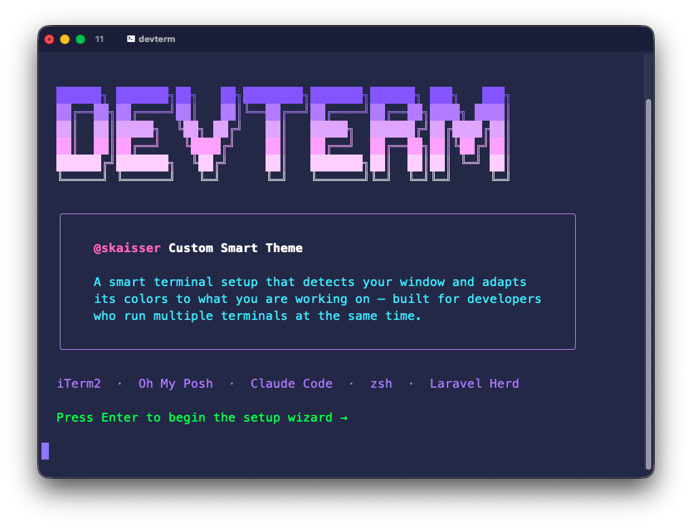
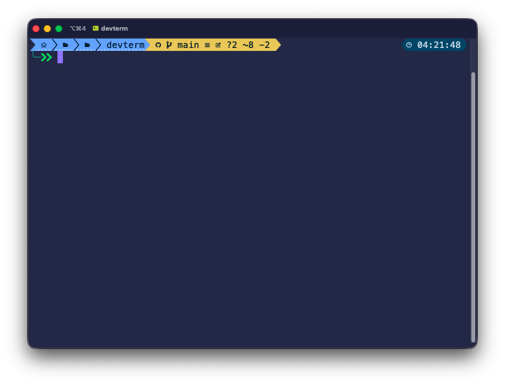
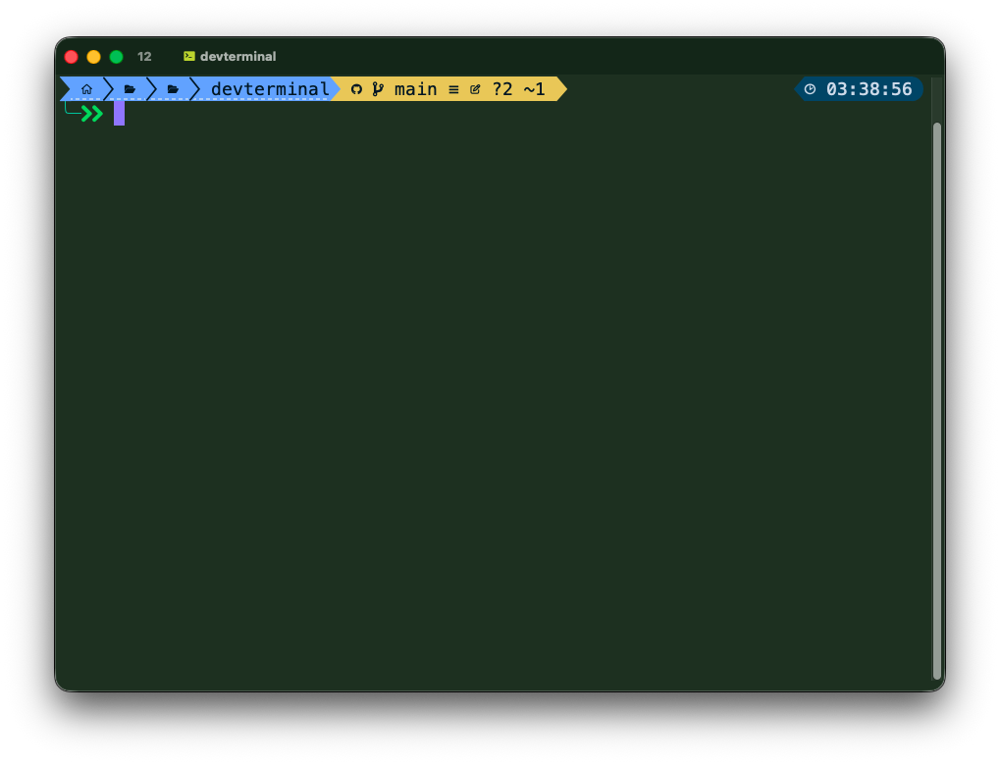
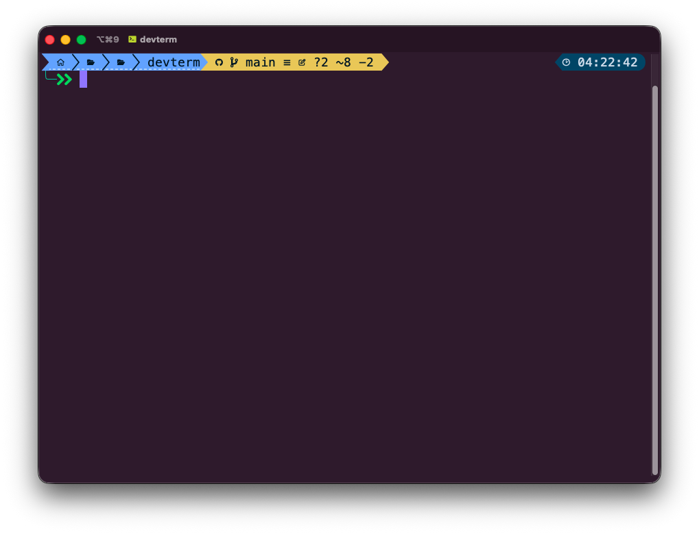
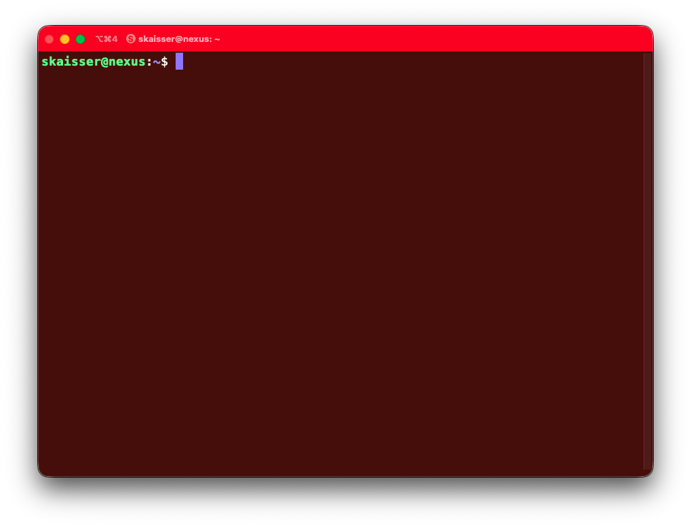
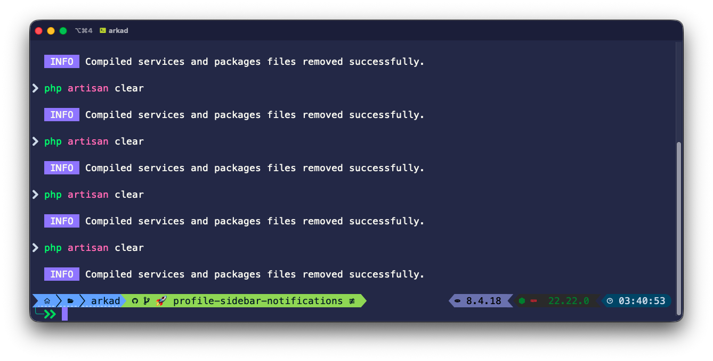
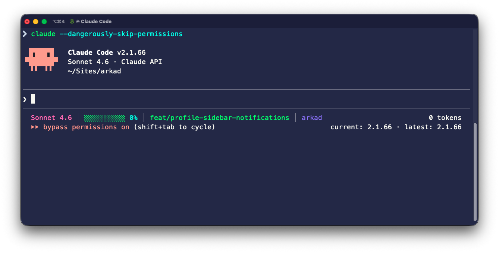

# DevTerm

### One command. Fresh Mac to full dev machine.

No setup guides. No dotfile rabbit holes. One command installs iTerm2, configures your font, prompt, colors, 50+ aliases, AI tools, and every dev essential — then gets out of your way.

[-blue?style=for-the-badge)](#install) [](LICENSE) [](https://github.com/skaisser/devterm) [](https://github.com/skaisser/devterm)

[](https://github.com/skaisser/devterm/stargazers) [](https://github.com/skaisser/devterm/network/members) [](https://github.com/skaisser/devterm/issues) [](https://github.com/skaisser/devterm/commits/main) [](https://github.com/skaisser/devterm/pulls)

> macOS 12+ · Apple Silicon + Intel · Works from any terminal

[:brazil: Leia em Portugues](README.pt-BR.md)



---

## Why DevTerm?

Setting up a new Mac for development means hours of installing tools, configuring shells, picking fonts, and wiring plugins together. DevTerm does all of that in one command:

- **Smart per-window themes** — open 4 terminals, always know which is which
- **SSH danger mode** — window goes red when you're on a remote server
- **Oh My Posh prompt** — git branch, PHP/Node versions, time — only when relevant
- **50+ aliases** — git, Laravel, navigation, system — all pre-configured
- **Idempotent installer** — run it again anytime, it only installs what's missing
- **Zero dependencies** — works on a fresh Mac straight out of the box

---

## Install

### Step 1: Open Terminal

Open **Terminal** on your Mac. You can find it in:
- `Applications > Utilities > Terminal`
- Or press `Cmd + Space`, type **Terminal**, and hit Enter

### Step 2: Copy and paste this command

```bash
bash <(curl -fsSL devterm.skaisser.dev)
```

Copy the line above, paste it into Terminal, and press **Enter**.

### Step 3: Follow the wizard

1. It will ask for your **Mac password** (you won't see it as you type — that's normal, just type and press Enter)
2. A setup wizard appears — press **Enter** to install everything (recommended), or type **n** to pick categories one by one
3. Wait for it to finish — first time takes ~15 minutes on a fresh Mac, much faster on re-runs

### Step 4: Open iTerm2

Everything is configured automatically — font, colors, appearance, and system hotkey.

1. Open **iTerm2** from Applications (or press **Cmd+`** from anywhere)
2. That's it. Everything works out of the box

> The devterm profile (MesloLGS Nerd Font 18, skaisser colors, Minimal appearance, unlimited scrollback) is set as default automatically.

### Other ways to install

```bash
# Clone and run locally (if you already have git)
git clone https://github.com/skaisser/devterm && cd devterm && ./install.sh

# Check what's installed without changing anything
./install.sh --check

# Remove devterm and restore your previous .zshrc
./install.sh --uninstall
```

> **First time on a fresh Mac?** Xcode Command Line Tools and Homebrew install automatically. The installer handles everything — no manual steps needed.

---

## Features

### The Smart Theme

Each terminal window gets a unique dark background based on its TTY — no config needed. Open multiple windows and always know which is which at a glance.

<table>
  <tr>
    <td align="center"></td>
    <td align="center"></td>
    <td align="center"></td>
  </tr>
  <tr>
    <td align="center">Indigo <code>#1a1a38</code></td>
    <td align="center">Forest green <code>#1a2a1a</code></td>
    <td align="center">Deep violet <code>#261426</code></td>
  </tr>
</table>

| Window | Color                  |
| ------ | ---------------------- |
| 1      | Deep navy `#1e2040`    |
| 2      | Forest green `#1a2a1a` |
| 3      | Burgundy `#2a1818`     |
| 4      | Indigo `#1a1a38`       |
| 5      | Teal `#0f2828`         |
| 6      | Dark plum `#1a0e2a`    |
| 7      | Deep violet `#261426`  |
| 8      | Emerald `#0e2a1a`      |

### SSH Danger Mode

```bash
ssh user@server  # entire window goes red so you never forget you're on production
```



Restores to its original color automatically when the session ends.

### The Prompt



```
 myapp   feat/login ~2 +1 ↑1      8.3.0   20.11.0   03:14:22
>>
```

| Segment         | Description                                                        |
| --------------- | ------------------------------------------------------------------ |
| **Path**        | Shortened: `~/Sites/myapp` → `myapp`                               |
| **Git**         | Branch, working (`~`), staged (`+`), ahead (`↑`), behind (`↓`)     |
| **PHP**         | Only shown inside PHP projects                                     |
| **Node**        | Only shown when `package.json` is present                          |
| **Go / Python** | Shown when relevant                                                |
| **Time**        | Right-aligned                                                      |

### Claude Code Statusline



Live context directly in your prompt — model, visual progress bar (green to yellow to red), token count, current project.

---

## What Gets Installed

The installer shows a **category picker** — press Enter to install everything (recommended) or type **n** to choose individually. Core tools always install no matter what.

### Core (always installed)

| Tool                   | What it does                                                                                         |
| ---------------------- | ---------------------------------------------------------------------------------------------------- |
| **iTerm2**             | Modern terminal emulator for macOS — supports smart themes, per-window colors, and SSH danger mode.  |
| **Nerd Fonts**         | MesloLGS NF + Fira Code NF — patched fonts with icons required for the prompt and file listings.     |
| **Oh My Posh + theme** | Prompt engine with the custom skaisser theme — shows path, git branch, language versions, and time.  |
| **zoxide**             | Smart `cd` replacement — learns your most-used directories. Type `z myapp` to jump anywhere.         |
| **zshrc config**       | Complete shell configuration with 50+ aliases, functions, smart window colors, and plugin sourcing. Your existing `.zshrc` is backed up automatically. |

### Optional categories

All pre-selected by default — just press Enter to install everything.

| Category | Tools |
| -------- | ----- |
| **Editor** | VS Code (desktop app + `code` CLI) |
| **CLI Tools** | eza (modern `ls`), fzf (fuzzy finder), gh (GitHub CLI), htop, lazygit, wget |
| **Zsh Plugins** | zsh-completions, zsh-autosuggestions, fast-syntax-highlighting, zsh-history-substring-search |
| **Claude Code** | AI coding assistant + live statusline |
| **PHP / Laravel** | Composer, Laravel Herd (serves `project.test` with HTTPS, includes PHP + MySQL) |
| **JavaScript** | nvm, Node 22 + 18, Bun, Yarn (skipped if Laravel Herd manages Node) |
| **DevOps** | rclone (cloud file sync — S3, Google Drive, Backblaze, 70+ providers) |
| **Extras** | tmux (terminal multiplexer), cmatrix (Matrix rain) |

---

## Quick Reference

<details>
<summary><strong>Navigation</strong></summary>

| Command          |                          |
| ---------------- | ------------------------ |
| `..` `..2` `..3` | Go up 1–3 levels         |
| `-`              | Previous directory       |
| `sites`          | Jump to `~/Sites`        |
| `z myapp`        | Jump anywhere (frecency) |
| `mkcd mydir`     | Create + enter directory |
| `cl`             | Clear                    |

</details>

<details>
<summary><strong>Git</strong></summary>

| Command        |                                           |
| -------------- | ----------------------------------------- |
| `gst`          | `git status`                              |
| `gd` / `gds`   | diff / staged diff                        |
| `gco` / `gcb`  | checkout / new branch                     |
| `gadd`         | Interactive hunk staging                  |
| `gp` / `gpush` | pull / push                               |
| `glog`         | Pretty graph log                          |
| `lazygit`      | Full TUI — stage hunks, resolve conflicts |

</details>

<details>
<summary><strong>File Listing</strong></summary>

| Command       |                              |
| ------------- | ---------------------------- |
| `ls`          | Icons + git status           |
| `l` / `ll`    | Long list / with permissions |
| `lt` / `la`   | Tree 2 levels / full tree    |
| `dud` / `duf` | Disk usage                   |

</details>

<details>
<summary><strong>PHP / Laravel</strong></summary>

| Command      |                              |
| ------------ | ---------------------------- |
| `art`        | `php artisan`                |
| `pt` / `ptp` | Pest / Pest parallel         |
| `tc` / `tcq` | Coverage / coverage parallel |
| `cda`        | `composer dump-autoload`     |
| `hfix`       | Restart Laravel Herd         |

</details>

<details>
<summary><strong>Claude Code</strong></summary>

| Command  |                         |
| -------- | ----------------------- |
| `claude` | Start Claude Code       |
| `claudd` | Skip permissions prompt |

</details>

<details>
<summary><strong>System</strong></summary>

| Command                 |                               |
| ----------------------- | ----------------------------- |
| `ports`                 | All listening ports           |
| `psg nginx`             | Search running processes      |
| `killp nginx`           | Kill by name (with confirm)   |
| `memusage` / `cpuusage` | Top consumers                 |
| `extract file.tar.gz`   | Extract any archive           |
| `weather "Paris"`       | Current weather               |

</details>

<details>
<summary><strong>Fuzzy Finder (fzf)</strong></summary>

| Shortcut |                        |
| -------- | ---------------------- |
| `Ctrl+R` | Search command history |
| `Ctrl+T` | Fuzzy-search files     |
| `Alt+C`  | cd into any directory  |

</details>

---

## Customization

### Change window colors

Edit `bg_colors` in `~/.zshrc`:

```bash
local bg_colors=(
    "1e2040"    # window 1 — any hex color
    "1a2a1a"    # window 2
    ...
)
```

### Machine-specific config

`~/.zshrc.local` is created automatically on first install with commented-out examples.
It's sourced at the end of `.zshrc` and never overwritten by reinstalls.

Use it for: API keys, work aliases, SSH agent, Docker shortcuts, custom PATH entries.

---

## Requirements

- macOS 12+ (Monterey or later)
- Apple Silicon or Intel
- Internet connection
- Any terminal (Terminal.app works — iTerm2 installs automatically)

Everything else installs automatically. No manual prerequisites.

---

## Contributing

Contributions are welcome! Feel free to open issues or submit pull requests.

1. Fork the repository
2. Create your feature branch (`git checkout -b feat/my-feature`)
3. Commit your changes
4. Push to the branch (`git push origin feat/my-feature`)
5. Open a Pull Request

---

## License

[Apache 2.0](LICENSE) — use freely, share openly.

---

Made by [Shirleyson Kaisser](https://github.com/skaisser)
